# Installing Python, the "right" way on macOS

## 0. If you don't have xcode command line tools installed

run `xcode-select --install` in terminal. Wait until it installs, open a new terminal window or better yet, restart your mac then follow next steps.

## 1. Installing Homebrew

If you already have homebrew installed, skip to step 2. If you're not sure whether or not you have it, open a terminal window (cmd+ space, type terminal, press enter) and run the following command:

```shell
brew
```

and press enter. If this is the output, brew is already installed.

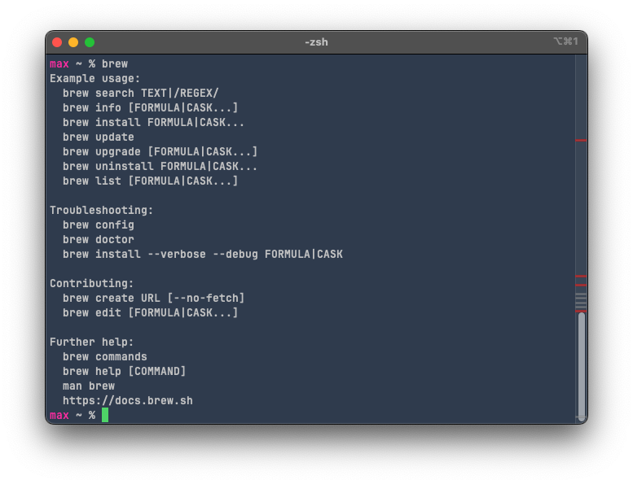

If you get an error, you need to install homebrew. Copy the command on [this webpage](https://brew.sh/), paste it into your terminal and press enter.

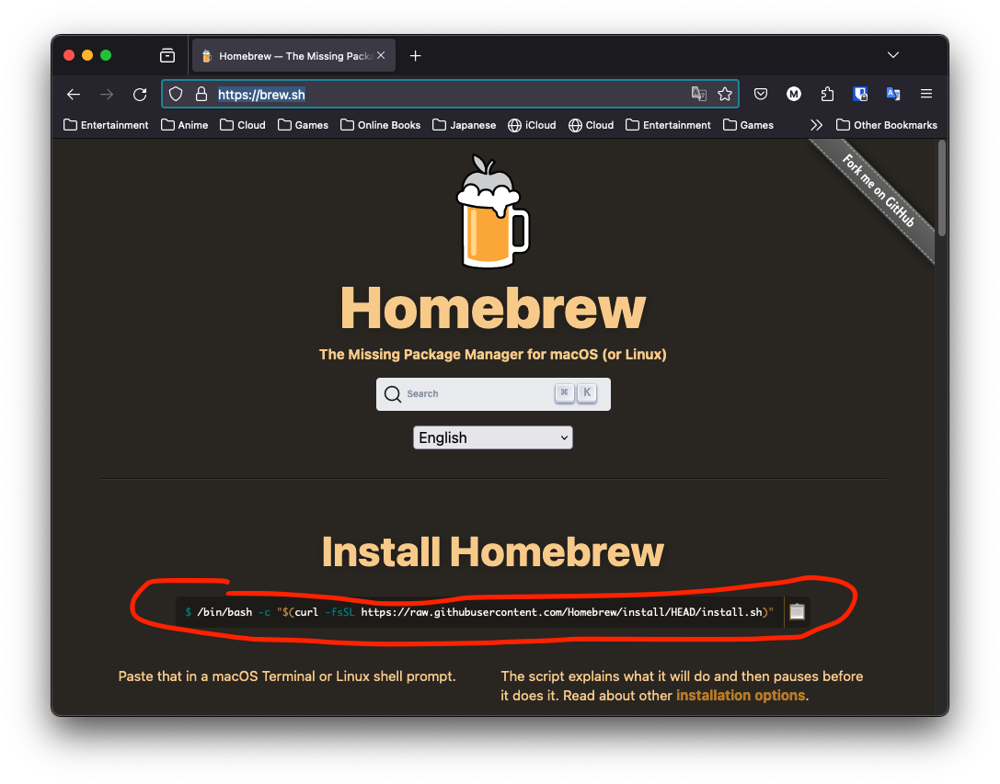

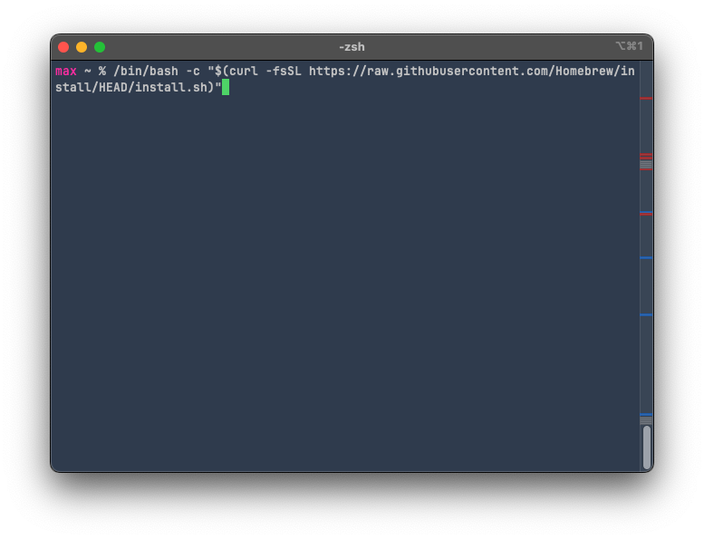

Once brew is installed, it might tell you to copy some lines of code and paste it into the terminal. Follow the instructions.

## 2. Installing pyenv

`pyenv` is a tool used to manage different versions and virtual environments of Python. It's by far the easiest way to install and uninstall both old and new versions of Python.

```shell
brew install pyenv
```

and let the command run until it's finished. Once it's done, follow any post-install instructions, or if there aren't any, proceed to the next step.

## 3. Ensuring pyenv can be seen by our shell

I'm going to assume everyone has zsh for their shell, because it's the default shell since Catalina. If you don't know what a shell is, don't worry about it, it probably won't matter.

Even after pyenv is installed and a version of python is selected, it might not be seen by the shell, and therefore the global version will still be the default installed on the mac:

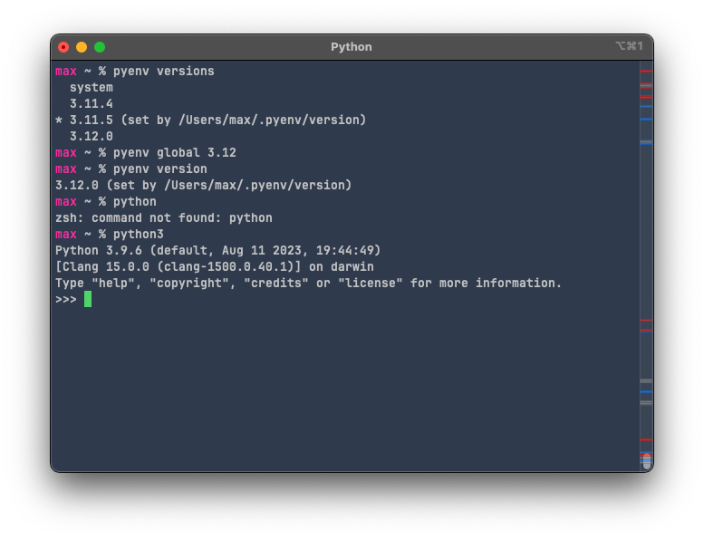

as you can see, I set the global Python version to 3.12, but I can't use the "python" command, and running "python3" throws me inside the default Python version - the system version installed by Apple (3.9.6 on my mac).

This is because zsh doesn't see our pyenv installation. We need to tell it to evaluate the pyenv installation location so that it knows to use it instead. 

Open a Finder window and go to your home folder. This will probably be your name: mine is called "max". It should be located in /Users/<name>.

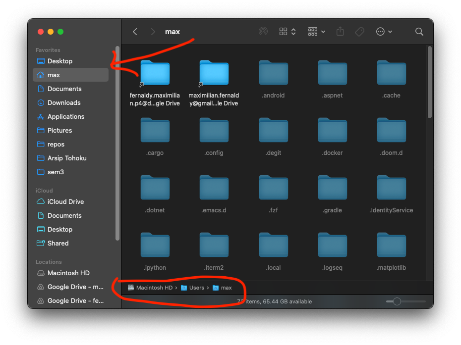

If you can't see hidden items, press Cmd+shift+. (dot). Look for the file named `.zprofile`. If it doesn't exist, create it by opening TextEdit, VSCode, vim, or whatever text editor you like. Make sure the directory is correct. Inside the file, type this in:

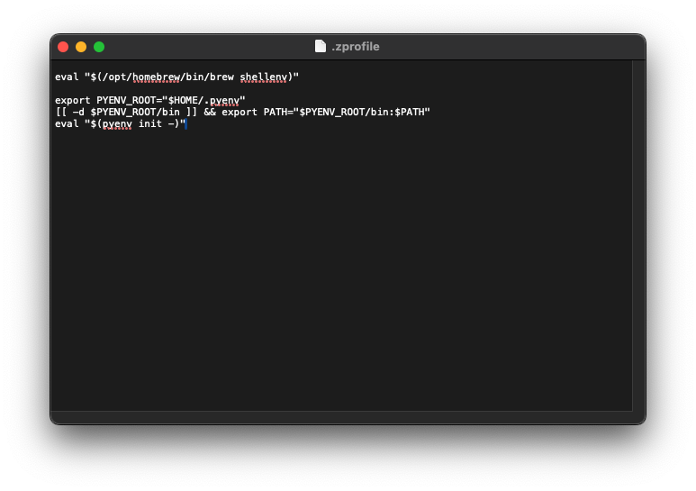

```she
eval "$(/opt/homebrew/bin/brew shellenv)"

export PYENV_ROOT="$HOME/.pyenv"
[[ -d $PYENV_ROOT/bin ]] && export PATH="$PYENV_ROOT/bin:$PATH"
eval "$(pyenv init -)"
```

Don't forget to save it before closing the file. I *think* the first line should be there already if you followed the post-install instructions for brew, but it basically allows us to use the keyword `brew` in the command line. Add it if it's not there yet.

## 4. Installing the python versions you need

Now open a new terminal window or tab. It basically just has to be a new shell instance. No, the old one won't work. Run `pyenv` and you should see the help text for `pyenv`. If you don't see it, make sure you did all the previous steps.

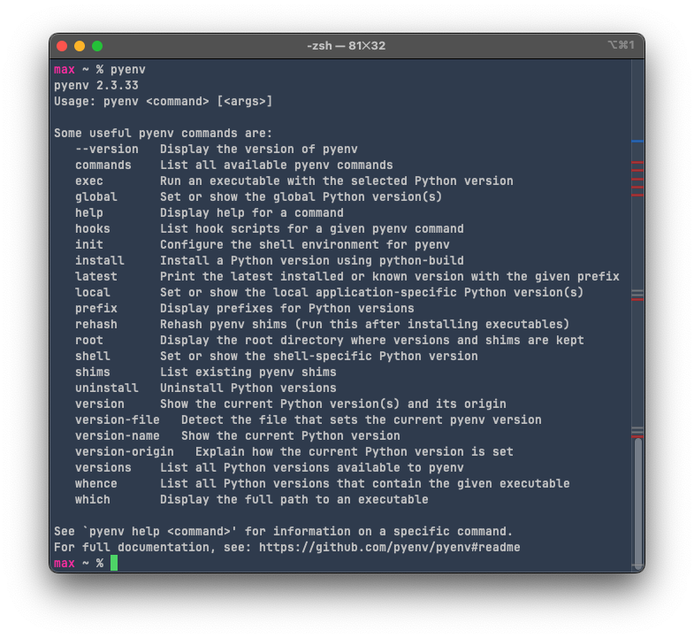

to install a python version, let's say 2.7, just type `pyenv install 2.7`.

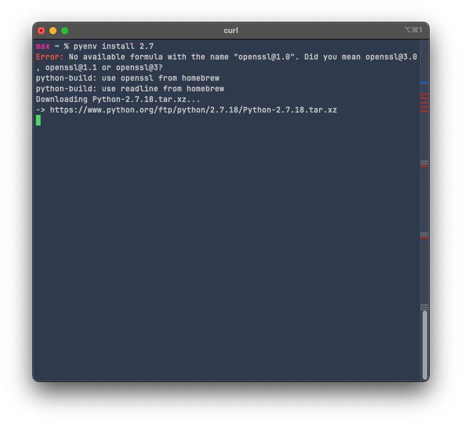

This might take a while. Once it's done, type `pyenv versions` and you should see it as one of the versions listed.

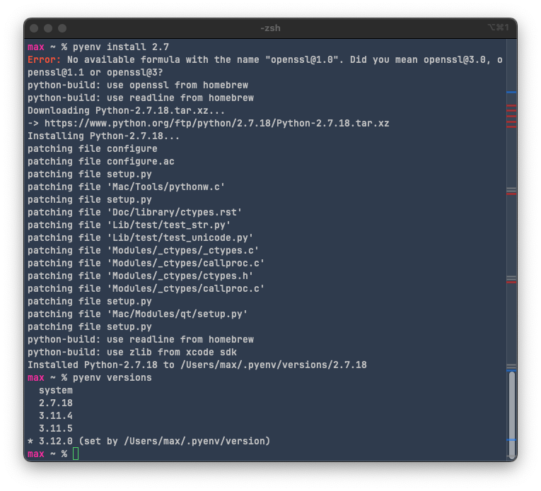

## 5. Using `pyenv` to set a global python version

`pyenv global <version>` will let you select a python version to use for whenever you type the command `python` in the system shell. This will also apply to whatever you do in integrated terminals/shells inside whatever IDE you use—VSCode, PyCharm, whatever. They are just front ends for your system shell, just like how Terminal (the application) is just a front end for the shell.

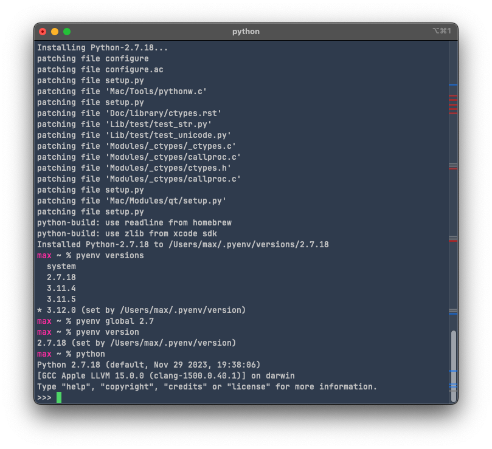

Now if you type `pyenv version` or launch the python shell with `python`, you should get the version you set with `pyenv global`. This also applies to running python files with `python file.py` too.

## Before you proceed...

TL;DR: In my opinion, a simple text editor and a terminal window is ideal if you really want to learn something from this class. But, I understand not everyone has the same interest in software development as I do. If you want to keep using VSCode, skip this section.

IDEs (Integrated Development Environments) are really meant for power users. IMHO, they provide little to no extra benefit for people like you and me who really just want to edit and run code. They also abstract a lot of the things that a beginner should learn how to do, like knowing how to use different python versions, how to run python code outside of an editor, using version control without the editor, etc.

So what do you do if you want autocomplete? Well, nowadays, most text editors will have support for autocomplete, so you don't really *need* an IDE if that's all you want. Technically, VSCode is a text editor, not a full-fledged IDE like PyCharm, but it has most of the properties of an IDE (and runs as slow as or even slower than an IDE, thanks to Electron). If you want to use an IDE, I would recommend [Thonny](https://thonny.org/) for basic Python development, but if you really must use VSCode, then the following section details how you use different Python versions with it.

Otherwise, [Sublime Text](https://www.sublimetext.com/) is very good for a basic text editor, and can be very powerful with plugins if you want them later. I personally use [Neovim](https://neovim.io/), but it has a far steeper learning curve.

## 6. VSCode interpreter setup

The text below on what's called the "Status Bar", details things about your project, language, extensions and for Python, the **interpreter**. Right now, it's set to a patch of 3.12 for me:

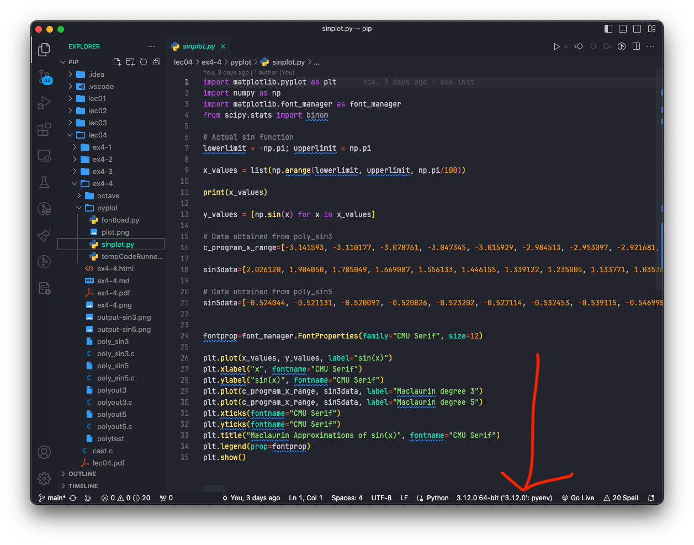

click on it and see what pops up on your command palette:


Usually, VSCode will recommend the latest version of Python you have installed. If this is your first time using Python on VSCode, you might not have anything configured at all, so it will ask you when you run a file to select an interpreter. I'm going to select the 2.7 version:


You should see the interpreter change at the bottom. Now when you run or debug the file, it will use the interpreter you specified.

## 7. Installing packages with pip

`pip` is the package manager of Python. It's like what `npm` is to NodeJS, or yarn for vanilla JS. Basically, it installs and gets rid of stuff. The super neat thing about `pyenv` is that it syncs up the `pip` version with our python version. Try running `pip -V` and take note of the version number. Then switch to another python version with `pyenv global <version>` and `pip -V` again. It will return a different pip version. This is because the libraries also get updated along with python, and using library versions that are too new or too old might break dependencies and our programs. This is why we should pick **one** version of Python for each project and stick with it (this is also why we have virtual environments, but I don't think we're going to go through that so I'll just leave it there. If you want to use a virtual environment too just search it up on stackoverflow or youtube, there's plenty of guides on there)

I'm going to use 3.11.4 (the version included in the dev env provided for Windows users in the class textbook). It's up to you to use whatever, but I might not be able to help you if you run into some problem down the road with compatibility issues.

Before installing anything with pip, run `pip install --upgrade pip` to make sure it's the latest pip version for the specific python version.

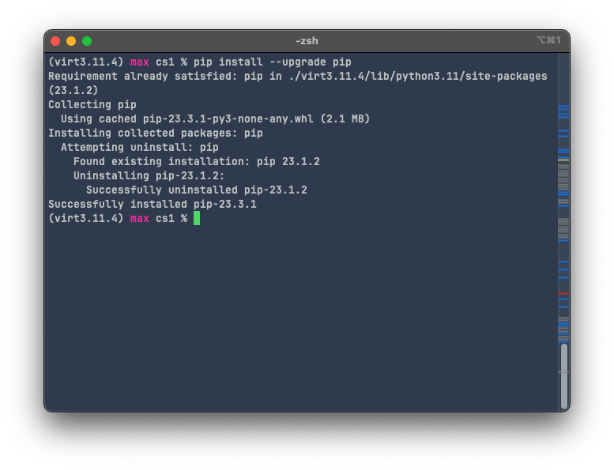

If you get this text you're all set. To install python packages with pip, you can do it one by one or stack them in one line separated by spaces:

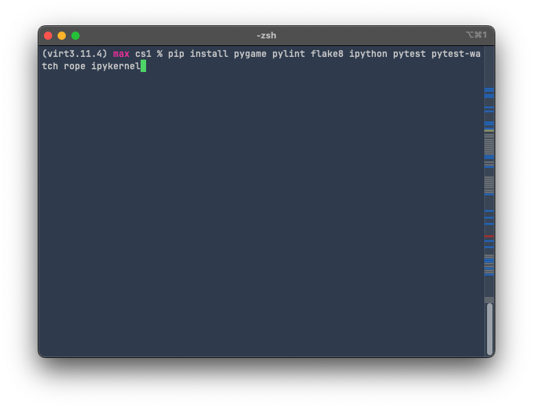

```shell
pip install pygame pylint flake8 ipython pytest pytest-watch rope ipykernel
```

Once it's done installing, run `pip freeze` to show the packages you installed and their dependencies.

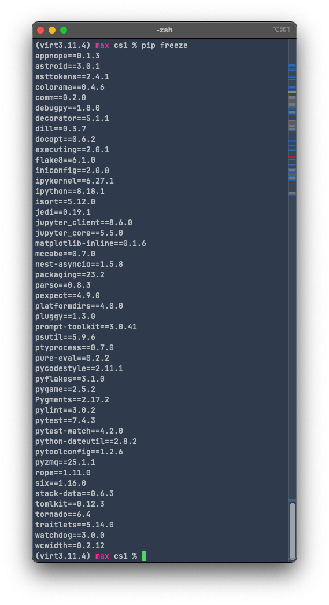

Alternatively if you're on a virtual environment, run `pip freeze > requirements.txt` to save the project-specific module requirements in a .txt file (you don't have to do it now, but it's helpful if we're going to build a .whl file later when our project is done)

That's it, you're done. You should now be able to do anything the libraries installed can do, like running the pygame example:

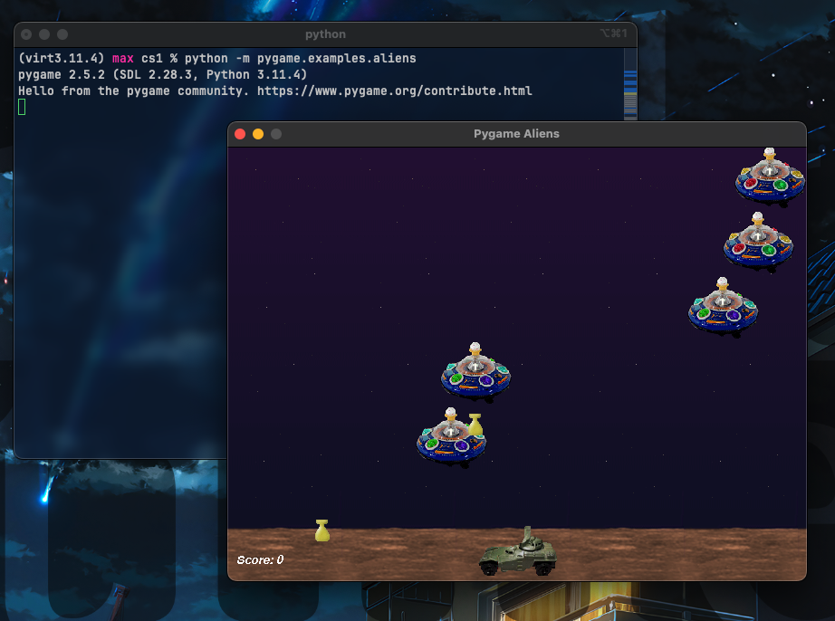

